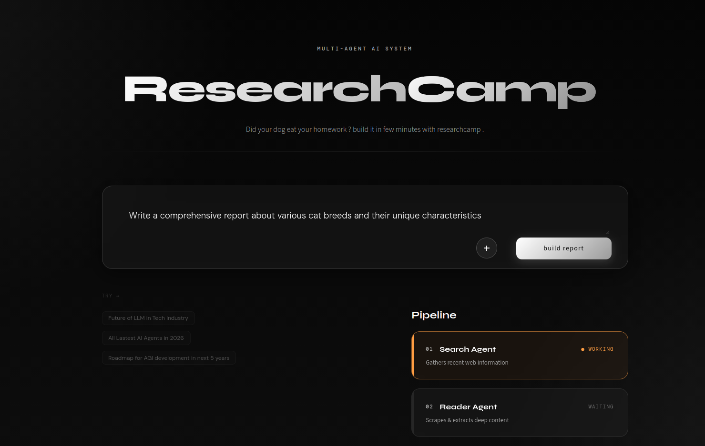
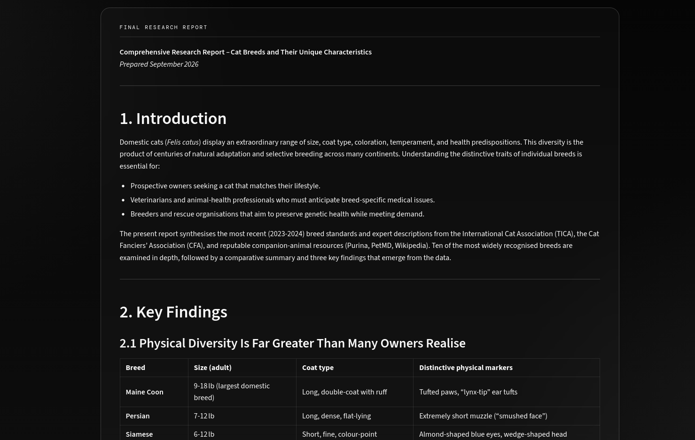
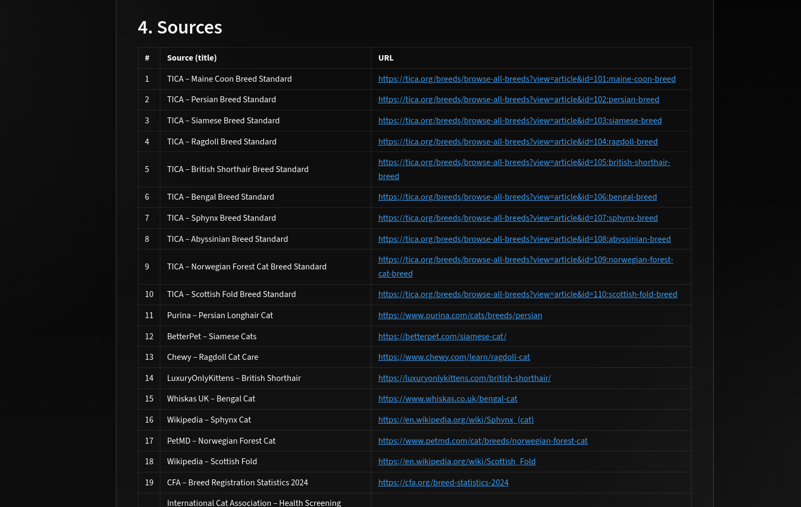

# ResearchCamp — Multi-Agent AI Researcher

ResearchCamp turns a single topic into a full, sourced research report. Give it a
prompt, and four agents/chains work through it in sequence — searching the web,
scraping the most relevant page, drafting a structured report, and critiquing it —
with live progress shown in a Streamlit UI.

<p align="center">
  
</p>

## How it works
```
┌─────────────────────────────────────────────────────┐
│           Streamlit UI (app.py)                     │
│      Multi-Agent Research Assistant Interface       │
└──────────────────┬──────────────────────────────────┘
                   │
┌──────────────────▼──────────────────────────────────┐
│      Research Pipeline (pipeline.py)                │
│        Orchestrates multi-agent workflow            │
└──────────────────┬──────────────────────────────────┘
                   │
    ┌──────────────┼──────────────┐
    │              │              │
┌───▼───┐    ┌────▼─────┐   ┌───▼────┐
│Search │    │   Reader  │   │ Writer │
│Agent  │    │   Agent   │   │ Chain  │
└───┬───┘    └────┬─────┘   └───┬────┘
    │             │             │
    │  ┌──────────▼─────────┐   │
    └─▶│  Tools Layer       │◀──┘
       │                    │
       │ • web_search      │
       │ • scrape_url      │
       │                    │
       └────────┬───────────┘
                │
            ┌───▼────────┐
            │ Critic     │
            │ Chain      │
            └────────────┘
```
1. **Search Agent** — queries Tavily for recent, reliable sources on the topic.
2. **Reader Agent** — picks the most relevant URL from the search results and
   scrapes it for deeper content (via `trafilatura` → `readability` → raw
   BeautifulSoup fallback).
3. **Writer Chain** — drafts a structured report (Introduction, Key Findings,
   Conclusion, Sources) from the combined search + scraped content.
4. **Critic Chain** — reviews the report and returns a score, strengths, and
   areas to improve.

All four steps are orchestrated by a single shared function,
`run_research_pipeline()`, used by both `main.py` (CLI) and `app.py`
(Streamlit UI) — so there's one source of truth for the pipeline logic.

## Project structure

```
research-tool/
├── app.py                    # Streamlit UI
├── main.py                   # CLI entry point
├── requirements.txt
├── .env                      # API keys (not committed)
└── src/
    ├── agents/
    │   └── agents.py         # Search/Reader agents + Writer/Critic chains
    ├── pipelines/
    │   └── pipeline.py       # run_research_pipeline() — shared orchestration
    └── tools/
        └── tools.py          # web_search (Tavily), scrape_url
```

## Setup

**1. Clone and enter the project**
```bash
git clone <your-repo-url>
cd research-tool
```

**2. Create and activate a virtual environment**
```bash
python -m venv .venv
source .venv/bin/activate        # Windows: .venv\Scripts\activate
```

**3. Install dependencies**
```bash
pip install -r requirements.txt
pip install python-docx fpdf2    # needed for the .docx/.pdf export buttons in app.py
```

**4. Set up environment variables**

Create a `.env` file in the project root:
```env
TAVILY_API_KEY=your_tavily_key
GROQ_API_KEY=your_groq_key
```

## Usage

**Run the Streamlit app**
```bash
streamlit run app.py
```
Then open `http://localhost:8501`, type a research topic, and click **build report**.

**Or run from the CLI**
```bash
python main.py
```
This runs the pipeline on the topic hardcoded in `main.py` and prints each step's
output to the terminal.

## Demo

Enter a topic and watch each pipeline stage update live:

<p align="center">
  
</p>

The finished report renders inline, with `.md` / `.docx` / `.pdf` export buttons
and a copy-to-clipboard button:

<p align="center">
  
</p>

Every report includes a sources table with the URLs the agents actually used:

<p align="center">
  
</p>

